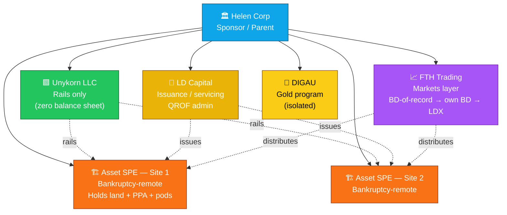

# GA-RWA-EDGE

**Institutional Real-World Asset rails for Georgia edge data centers, QROF equity, power-anchored (PPA) deals, renewables, and hybrid energy — on the Unykorn zero-balance-sheet architecture.**

[](https://soliditylang.org)
[](https://book.getfoundry.sh)
[](https://eips.ethereum.org)
[](./LICENSE)
[](./README.md#-security--compliance)
[](https://fthtrading.github.io/GA-RWA-EDGE/)

**📄 Client Center (GitHub Pages):** [fthtrading.github.io/GA-RWA-EDGE](https://fthtrading.github.io/GA-RWA-EDGE/) — 8 PDF downloads, client requirements & diligence guide, calculators, and integration schemas.

---

## 🧭 Table of Contents

- [🟦 Smart Contracts](#-smart-contracts)
- [🟩 MCP Agentic Fleet](#-mcp-agentic-fleet)
- [🟨 Documentation & Playbooks](#-documentation--playbooks)
- [🟧 Georgia Configuration](#-georgia-configuration)
- [🟥 Security & Compliance](#-security--compliance)
- [🟪 Frontend Portals](#-frontend-portals)
- [⬛ Templates & Legal](#-templates--legal)
- [🚀 Quick Start](#-quick-start)
- [📐 Architecture](#-architecture)
- [⚖️ Role Separation](#-role-separation)
- [🧮 Calculators & TREX Models](#-calculators--trex-models)
- [🎯 Deal Sprint — 20 MW Atlanta PPA](#-deal-sprint--20-mw-atlanta-ppa)
- [📎 References](#-references)

---

## 📐 Architecture



---

## ⚖️ Role Separation

| Entity | Role | Never Does | Fee Model |
|---|---|---|---|
| **Helen Corp** | Sponsor / parent · brand · guarantees · equity carry | Directly operate rails or hold securities | Sponsor promote from SPE waterfalls |
| **Unykorn LLC** | Technology rails · compliance · attestation · waterfall infrastructure | Hold investor capital or assets; take transaction-based securities comp | Setup + SaaS + per-attestation + per-distribution + license |
| **LD Capital** | Issuance · structuring · QOF/QROF administration · servicing | Custody assets; operate secondary markets | 1-3% of raise + 25-100 bps servicing + fixed QOF admin |
| **FTH Trading** | Securities distribution · BD-of-record now · own BD Stage 2 · LDX-as-ATS Stage 3 | Own SPE assets; run rails infrastructure | Placement fees (Stage 2+) + LDX listing + trading bps |
| **Asset SPEs** | Bankruptcy-remote holders of land / PPA / pods / hosting contracts / equipment titles | Business other than the specific asset | Conduits — no earnings by design |

**The rule that makes it all fundable:** money never sits in Unykorn or FTH. Assets live only in Site SPEs.
Every claim in this repo maps to a receipt at one of these five entities.

---

## 🟦 Smart Contracts

**27 Solidity files compiling clean under solc 0.8.36 (EVM Cancun).**
`Compiler run successful.` See [contracts/README.md](./contracts/README.md).

| Domain | Contracts |
|---|---|
| **Core** | `Roles` · `ECDSALib` · `AttestationVerifier` · `ReserveProofAnchor` · `DealRegistry` · `CustodyAdapter` · `AMLTravelRuleGate` · `LDTimelock` · `ReentrancyGuard` · `FeeCollector` |
| **Compliance** | `IdentityRegistry` · `ModularCompliance` · `LDSecurityToken` (ERC-3643) |
| **Modules** | `Rule144LockupModule` · `CountryRestrictModule` · `MaxHoldersModule` |
| **Capital / paths/cmbs** | `TrancheToken` · `DSCRTrigger` · `CMBSWaterfall` |
| **Vaults** | `AsyncVault` (ERC-7540 seed) · `MultiAssetEntry` (ERC-7575 seed) |
| **ESG** | `SRECModule` · `CarbonModule` · `GasAttestation` |
| **Interfaces** | `ICompliance` · `IERC20` |

**Non-negotiable rules:**

- 🟥 **Priority 1 in every waterfall = utility / PPA payment.** Miss it → utility termination → deal dies.
- 🟥 **Unykorn holds no investor value.** Contracts enforce this via the Fee model + Site SPE ownership.
- 🟥 **Compliance is a hard gate before value moves.** ERC-3643 IdentityRegistry + AMLTravelRuleGate on every transfer.
- 🟥 **Integer minor units only.** All values in cents / minor units to avoid decimal drift.

Build:

```bash
cd contracts
forge build
```

---

## 🟩 MCP Agentic Fleet

Scaffolding for the multi-agent operational layer. See [agents/README.md](./agents/README.md).

| Agent | Role | Backing tools (MCP servers) |
|---|---|---|
| `DealOnboardingAgent` | Ingest PPA + site + KYC packages, run diligence, propose SPE structure | `document-server` · `chain-server` |
| `AttestationAgent` | Watch for new documents, hash them, call `ReserveProofAnchor` | `document-server` · `oracle-server` |
| `ComplianceAgent` | Monitor `IdentityRegistry`, AML gates, travel-rule events | `kyc-server` · `chain-server` |
| `WaterfallAgent` | Execute and monitor `CMBSWaterfall.distribute()` | `chain-server` |
| `CapitalStackAgent` | Model QROF step-up, ITC, tax-equity sizing, DSCR, LTV | Spreadsheet / model export |
| `InvestorReportingAgent` | Generate on-chain + off-chain reports | `document-server` · `email-server` |
| `RiskMonitoringAgent` | DSCR, PPA termination risk, rural qualification flags | `chain-server` · `oracle-server` |
| `GeorgiaEnergyAgent` | GA-specific zoning, voluntary RECs, gas hybrid, rural QROF screening | `document-server` + `config/georgia/*.json` |

---

## 🟨 Documentation & Playbooks

Institutional-grade markdown documentation. See [docs/README.md](./docs/README.md).

| Section | What's inside |
|---|---|
| [`01-architecture/`](./docs/01-architecture/) | System diagrams · role separation · entity flow |
| [`02-tax-esg-incentives/`](./docs/02-tax-esg-incentives/) | QROF · ITC §48E · MACRS + bonus + §179 · Partnership Flip · ESG/SREC/carbon metrics |
| [`03-capital-stack/`](./docs/03-capital-stack/) | Base case · 5 sensitivity tables · 20 MW quick reference |
| [`04-georgia-playbook/`](./docs/04-georgia-playbook/) | Zoning matrix · rural QROF definition · site-pairing decisions |
| [`05-deal-templates/`](./docs/05-deal-templates/) | 12-item PPA diligence · Barak worked example · risk register |
| [`06-epc-and-ppa/`](./docs/06-epc-and-ppa/) | 12-clause EPC contract review · red flags · ReserveProofAnchor evidence chain |
| [`07-deployment/`](./docs/07-deployment/) | Testnet → mainnet deployment runbook |
| [`09-calculators/`](./docs/09-calculators/) | Calculators & TREX models inventory + build sequence |

Companion HTML playbooks (visual, print-ready) live at `fth-trading-system/docs/verticals/`.

---

## 🟧 Georgia Configuration

See [config/README.md](./config/README.md).

```text
config/georgia/energy-params.json    Utility pathways · PSC large-load rule · sales-tax
                                     exemption + 5 attacking bills · OBBBA ITC/PTC/45Q/45V.
config/georgia/zoning-matrix.json    18 jurisdictions ranked NO / YES_WITH_LETTER / BEST.
                                     Atlanta / DeKalb / Fayetteville / Palmetto = NO.
                                     Urbanized-area caveat baked in.
config/georgia/rural-tracts.json     Nomination window (closes Sept 29, 2026 → Jan 1, 2027 effective).
                                     Primary Path B tracts + backups + border-state expansion (TVA / VA / SC).
```

**Critical:** the QROF rural test is stricter than casual intuition. See
[docs/04-georgia-playbook/rural-definition.md](./docs/04-georgia-playbook/rural-definition.md).

---

## 🟥 Security & Compliance

**This repository is scaffolding + audited-elsewhere seeds — not a mainnet-ready system.**

**Pre-mainnet blockers (unchanged):**

- ⛔ Dual independent smart-contract security audits
- ⛔ Securities counsel Rule 144 opinion + full 506(c) / Reg S offering documents
- ⛔ Off-chain legal SPV package behind every `ReserveProofAnchor` attestation
- ⛔ BD registration (own) or BD-of-record engagement for third-party distribution
- ⛔ BitGo Bank & Trust N.A. (or Anchorage) custody engagement
- ⛔ CPA administrator for QOF/QROF 90% asset test + OBBBA reporting

**What this repo IS:**

- ✅ Compilable Solidity foundation (27 files, solc 0.8.36, EVM Cancun)
- ✅ Institutional-quality documentation covering the entire play
- ✅ Georgia-specific configuration seeds
- ✅ Ready for handoff to Solidity + agent + frontend teams

**What this repo IS NOT:**

- ❌ Production-deployable securities infrastructure
- ❌ A substitute for licensed OZ counsel, tax counsel, or securities counsel
- ❌ An offer to sell securities

---

## 🟪 Frontend Portals

Scaffolding for admin + investor portals. Next.js structure planned. See [frontend/README.md](./frontend/README.md).

Planned surfaces:

- **Admin portal** — deal registration, SPE management, waterfall configuration, attestation monitoring
- **Investor portal** — accredited-investor onboarding (Persona / Parallel Markets), subscription, waterfall claims, secondary transfer requests
- **Sponsor portal** — Barak-type originator intake, PPA / site / KYC upload → feeds `DealOnboardingAgent`

---

## ⬛ Templates & Legal

Operational and legal-ready templates. See [templates/README.md](./templates/README.md).

- SPE operating agreement outline (Delaware / Wyoming series)
- 506(c) PPM outline
- Barak PPA assignment / contribution agreement outline
- Senior lender one-page teaser
- QROF fund formation checklist
- Master Services Agreement (Unykorn ↔ SPE)

---

## 🚀 Quick Start

**For developers (contracts):**

```bash
git clone https://github.com/FTHTrading/GA-RWA-EDGE.git
cd GA-RWA-EDGE/contracts
forge build
forge test
```

**For deal teams (documentation):**

Start with [docs/01-architecture/README.md](./docs/01-architecture/), then read
[docs/05-deal-templates/ppa-diligence.md](./docs/05-deal-templates/ppa-diligence.md) to understand the
Go/No-Go pack, then [docs/03-capital-stack/sensitivity.md](./docs/03-capital-stack/sensitivity.md) for
sizing, then [docs/02-tax-esg-incentives/formulas.md](./docs/02-tax-esg-incentives/formulas.md) for the
tax math.

**For calculators / TREX modeling:**

Read [docs/09-calculators/inventory.md](./docs/09-calculators/inventory.md) for the full build queue
and P0/P1/P2 priorities.

---

## 🧮 Calculators & TREX Models

Build queue (highest-ROI internal tooling). See [docs/09-calculators/inventory.md](./docs/09-calculators/inventory.md).

**P0 (Weeks 1-2):**

- 🟨 QROF / OZ 2.0 Step-Up Calculator
- 🟨 ITC §48E Calculator (with 50% basis reduction)
- 🟨 MACRS + Bonus Depreciation Calculator
- 🟨 Combined Tax Benefit Stacker
- 🟩 Partnership Flip / TREX Sizing Engine (99/1 → 5/95)
- 🟦 Full Capital Stack + DSCR Sensitivity (PPA-aware)

**P0 (Weeks 3-4):**

- 🟧 Site Evaluation Scorecard (digital Canovate-pattern)
- 🟧 Modular Pod + PUE + Cooling Sizer
- 🟨 PPA Diligence Auto-Scorer

**P0 (Weeks 5-6):**

- 🟩 ReserveProofAnchor Payload Generator
- 🟥 ESG / Carbon Intensity Dashboard
- 🟪 Client Intake Portal → DealRegistry handoff

---

## 🎯 Deal Sprint — 20 MW Atlanta PPA

Working document lives at
[fth-trading-system/docs/verticals/ppa-anchor-deal-structuring.html](../fth-trading-system/docs/verticals/ppa-anchor-deal-structuring.html)
(companion HTML), summarized in [docs/05-deal-templates/barak-worked-example.md](./docs/05-deal-templates/barak-worked-example.md).

**Critical path — the four PPA diligence items:**

1. Delivery point / substation / voltage
2. Term length + rate structure
3. Assignability language + Barak entity authority
4. Utility posture on novation vs assignment-only

Once these land: capital-stack base column locks · lender teasers issue · `ReserveProofAnchor` schema
configures · 12-week sprint to Jan 1, 2027 deploy activates.

---

## 📎 References

**External sources (verified July 2026):**

- [Atlanta Ordinance 24-O-1222](https://atlantacitycouncil.medium.com/atlanta-city-council-votes-to-define-data-centers-limit-locations-1ee61f0e225b)
- [YCPC Data Center Model Ordinance (April 2026)](https://www.ycpc.org/DocumentCenter/View/5537/Data-Centers-Model-Ordinance---2026-Update-PDF?bidId=)
- [GA PSC Data Center Fact Sheet March 2026](https://psc.ga.gov/site/downloads/datacenterfactsheet.pdf)
- [Alston & Bird — GA sales-tax exemption analysis](https://www.alston.com/en/insights/publications/2026/02/georgia-sales-tax-exemptions-data-centers)
- [Arnold & Porter — OBBBA clean-energy credits](https://www.arnoldporter.com/en/perspectives/advisories/2025/07/from-ira-to-obbba-a-new-era-for-clean-energy-tax-credits)
- [NADO OZ 2.0 Resource Guide](https://www.nado.org/opportunity-zones-2-0-resource-guide/)
- [Georgia DCA State Opportunity Zone maps](https://dca.georgia.gov/financing-tools/incentives/state-opportunity-zones/designations-and-maps)
- [BitGo — OCC full national trust bank approval](https://www.bitgo.com/resources/blog/bitgo-secures-occ-approval/)
- [Ondo Finance](https://ondo.finance/) · [Centrifuge V3 CTO perspective](https://centrifuge.io/blog/centrifuge-v3-cto-perspective) · [Centrifuge RWA Launchpad](https://centrifuge.io/blog/centrifuge-rwa-launchpad)

**Peer landscape:**

- [Applied Digital × CoreWeave 250 MW lease](https://ir.applieddigital.com/news-events/press-releases/detail/123/applied-digital-announces-250mw-ai-data-center-lease-with)
- [Soluna 10-K (SLNH) — 4.3 GW pipeline](https://www.stocktitan.net/sec-filings/SLNH/10-k-soluna-holdings-inc-files-annual-report-200b7549b0cb.html)
- [Crusoe $1.3B raise — AI factory pivot](https://siliconangle.com/2025/10/23/crusoe-lands-1-3b-accelerate-buildout-large-scale-ai-data-centers/)
- [IREN Horizon Texas + Microsoft $9.7B](https://www.datacenterdynamics.com/en/news/iren-plans-75mw-liquid-cooled-ai-data-center-in-texas/)

**GPU-backed lending / DC securitization:**

- [CoreWeave $8.5B IG-rated GPU-backed DDTL (March 2026)](https://investors.coreweave.com/news/news-details/2026/CoreWeave-Closes-Landmark-8-5-Billion-Financing-Facility-Achieving-First-Investment-Grade-Rated-GPU-backed-Financing/default.aspx)
- [Apollo + Blackstone $35B AI chip lending](https://pitchbook.com/news/articles/apollo-blackstone-lend-35b-against-ai-chips-computing-power)
- [SFA Research — DC ABS & CMBS ecosystem](https://structuredfinance.org/wp-content/uploads/2026/07/SFA-Research-Corner_How-Data-Center-ABS-and-CMBS-Fit-in-a-Broader-Financing-Ecosystem.pdf)

---

_Non-custodial · compliance-gated · deterministic — institutional infrastructure for tokenized real-world assets._

_© 2026 FTH Trading / Helen Corp group. Not tax, legal, or investment advice. Nothing in this repository is an offer to sell securities. All figures are planning-grade and require licensed counsel review before any deployment._
