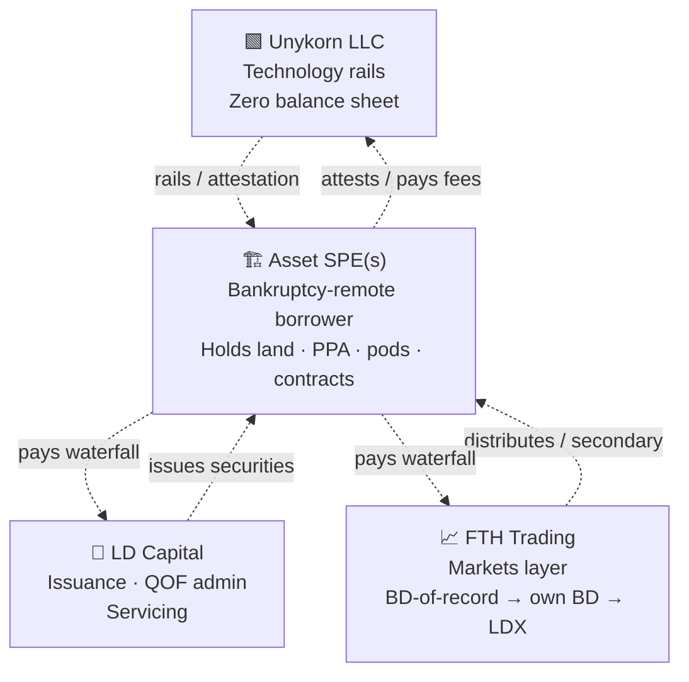

# Architecture

**Four entities · zero role overlap · Unykorn holds no capital.**

## Entity flow



## Role separation table

| Entity | Does | Never Does | Fee model |
|---|---|---|---|
| **Unykorn LLC** | Technology rails · compliance · attestation · waterfall infra | Hold investor capital or assets · take transaction-based securities comp | Setup + SaaS + per-attestation + per-distribution + license (routed via `FeeCollector`) |
| **LD Capital** | Issuance · structuring · QOF/QROF administration · servicing | Custody assets · operate secondary markets | 1-3% of raise + 25-100 bps servicing + fixed QOF admin |
| **FTH Trading** | Securities distribution · BD-of-record now · own BD Stage 2 · LDX-as-ATS Stage 3 | Own SPE assets · run rails | Placement fees (Stage 2+) + LDX listing + trading bps |
| **Asset SPEs** | Bankruptcy-remote holders of the real assets | Business other than the specific asset | Conduits — no earnings by design |

## The rule that makes it fundable

**Money never sits in Unykorn or FTH. Assets live only in Site SPEs.**

Every senior lender (Peachtree / CIM / Goldman / USDA / C-PACE) demands a clean SPE borrower — they get one. Securities regulators see issuance under exemptions and, later, a registered BD doing only BD things. The tech company (Unykorn) sells rails with zero balance-sheet risk. FTH Trading concentrates every activity that needs FINRA registration in one entity, so the rest of the house never trips a licensing wire.

## The seven-layer pipeline

```text
L7  BUYERS & VENUES         FTH Trading BD-of-record → own BD → LDX ATS
                            Centrifuge V3 pools · Anemoy tranches · Partner ATS (tZERO)

L6  SETTLEMENT MEDIUM       USDC (GENIUS Act framework) · Ondo USDY (offshore)
                            BUIDL / OUSG (institutional treasury cash)

L5  SECONDARY/DISTRIBUTION  Compliance-gated transfers · Form ATS venue (Stage 3)

L4  ISSUANCE (LD Capital)   ERC-3643 mint via CustodyAdapter 4-eyes · DealRegistry
                            LDSecurityToken / TrancheToken / NoteToken / RECToken / CarbonToken

L3  COMPLIANCE (Unykorn)    IdentityRegistry · AMLTravelRuleGate · ONCHAINID

L2  ATTESTATION & ORACLE    ReserveProofAnchor · AttestationVerifier (m-of-n)
                            PCAOB auditors · Chainlink PoR · M-RETS/PJM-GATS registries

L1  ASSET & CUSTODY         Site SPE (bankruptcy-remote LLC)
                            BitGo Bank & Trust N.A. · Anchorage · Fireblocks

L0  PHYSICAL REALITY        Real estate · modular pods · solar meters
                            LBMA-allocated gold · attested carbon retirement
```

Only L0 (physical thing) and L7 (buyer) change by asset class. Everything else is shared infrastructure that Unykorn already ships.

## What's on-chain vs off-chain

**On-chain (evidence):**

- Every transfer of value
- Every attestation hash (documents, meter readings, EPC certificates)
- Every waterfall distribution
- Every identity claim
- Every deal registration

**Off-chain (authority):**

- SPE legal formation and operating agreements
- PPA execution and utility consent
- Securities counsel opinions (Rule 144, offering exemption)
- CPA administrator's QOF 90% asset-test filings
- Real-world money (senior debt, escrow releases, tax-equity funding)
- BitGo Bank & Trust custody policies

The on-chain layer **evidences** the off-chain authority — it does not replace it. This is why the group is legally durable: every "compliance check" the code enforces has a licensed counterparty responsible for the underlying fact.
